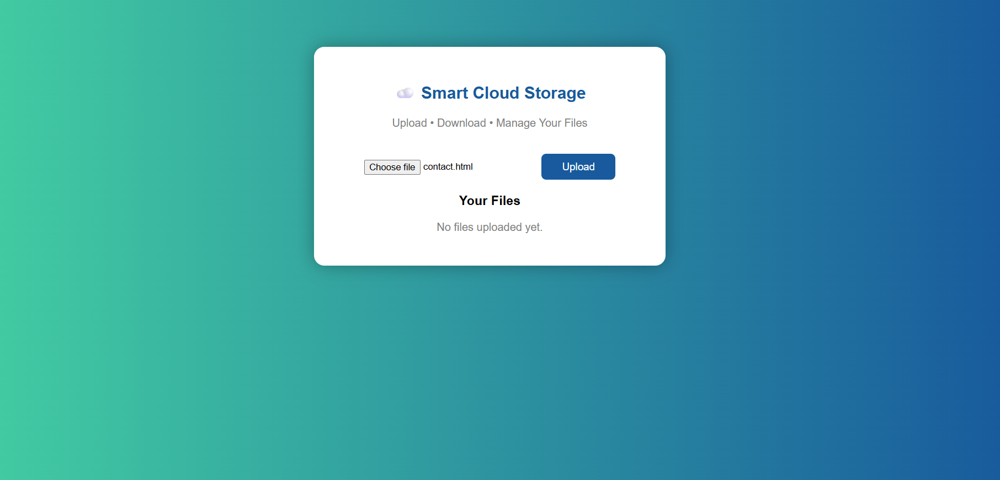
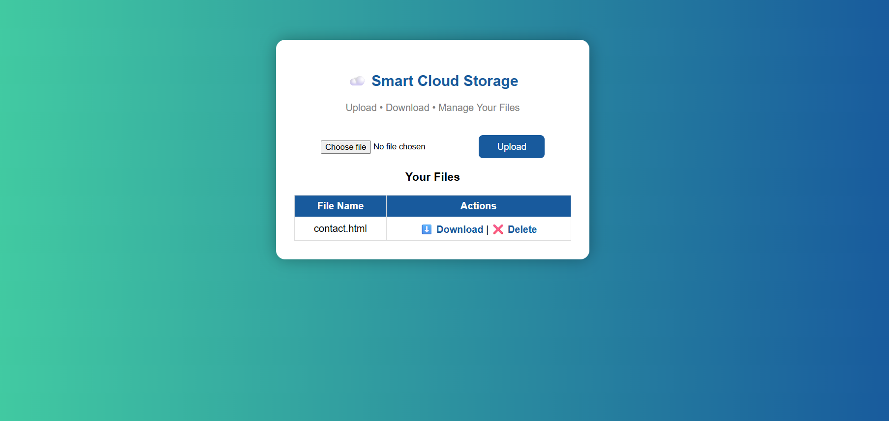
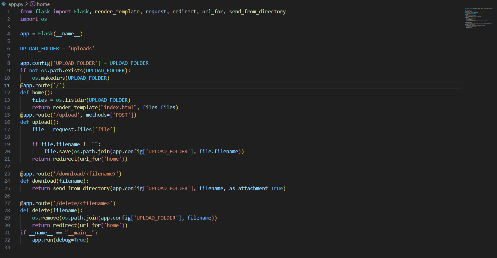

# ☁️ Cloud File Storage System using AWS & Flask

A web-based application that allows users to upload and store files securely on AWS S3 using Python Flask.

---

## 🚀 Features
- Upload files to cloud
- Store files in AWS S3
- Simple and clean UI
- Secure storage
- Easy to use

---

## 🛠️ Tech Stack
- Python
- Flask
- AWS S3
- Boto3
- HTML
- CSS

---

## 📁 Project Structure

├── app.py
├── index.html
├── style.css
├── screenshot1.png
├── screenshot2.png
├── screenshot3.png
├── vdo.mp4
└── README.md

---

## 📸 Screenshots

### 🔹 Home Page

### 🔹 Upload Page

### 🔹 File View

---

## 🎥 Demo Video

[Click here to watch demo](vdo.mp4)

---

## ⚙️ Installation & Setup

1. Clone the repository

2. Install dependencies

4. Open in browser

---

## ☁️ AWS Configuration

- Create an S3 bucket
- Configure AWS credentials
- Add credentials in your environment
- Connect using Boto3

---

## 👩‍💻 Developed By

**Khadija Jamadar**

Computer Science Student  
AWS Certified Developer – Associate (In Progress)

---

## 🌟 Future Improvements
- User authentication
- Database integration
- File sharing option
- Better UI
